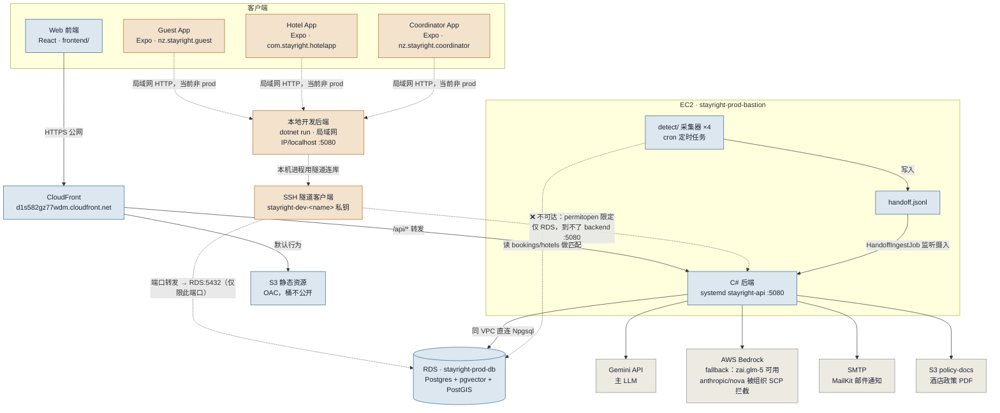
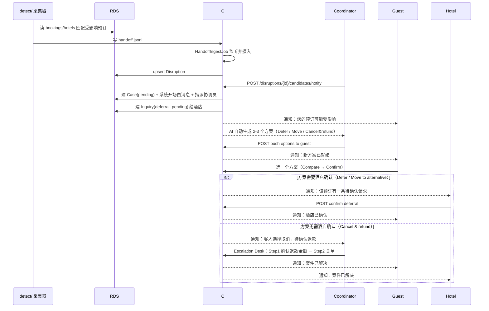

# 系统结构图 & 关键时序图

**最后核实**：2026-09-24（对照代码/AWS 控制台实际核实过一遍，不是凭记忆写的）

这份文档回答两个问题：

1. **结构图**——Web 前端、三个手机 App、后端、数据库、外部服务之间实际连的是谁、走的是哪条路（当前状态，含"手机 App 目前没打通 prod"这个容易搞混的点）。
2. **时序图**——一条扰动从被采集到案件解决，具体按什么顺序经过哪些接口（对应 `CLAUDE.md`"必须遵循的模式"里"采集 → 变化检测 → 匹配 → 闸门 → 裁决 → 触达 → 回调 → 重订"那条描述，这里画成了实际验证过的接口调用顺序）。

两张图都用 Mermaid 写，GitHub 打开本文件会直接渲染，不需要额外工具；改代码/改部署方式之后，**图跟着改，不要让它变成第二份漂移的文档**。

---

## 1. 系统结构图

**图例**：蓝色系 = prod 生产链路；橙色系 = 手机 App 目前实际走的路径（连本地开发后端，本地后端再经受限 SSH 隧道连 prod RDS）；灰色 = 后端对外调用的外部服务。虚线箭头（含那条带 ❌ 的）是当前验证过"确实走不通/不是常态"的连接，画出来是为了显式标注边界，不是设计目标。

### 几个容易搞混的点

- **手机 App 现在没有连 prod**：三个 App 默认地址都是局域网 IP（`192.168.68.50:5080`）或 `localhost:5080`，仓库里搜不到 CloudFront 域名。要打通需要给它们加一份指向 `https://d1s582gz77wdm.cloudfront.net` 的生产构建配置（`EXPO_PUBLIC_API_BASE_URL`），而且要注意 Cookie/Session 认证在 App 的跨域 HTTPS 场景下是否稳定，需要实测，不能假设它自动和 Web 端行为一致。
- **SSH 隧道到不了 EC2 后端**：给团队开的 key 用 `permitopen="<rds-host>:5432"` 精确限定，只能转发到 RDS 这一个地址的这一个端口，到不了同一台 EC2 上跑的后端（:5080）——两条独立通道，不是"能连库就能连后端"。
- **EC2 后端连库不走隧道**：它和 RDS 同一个 VPC，直连 Npgsql，SSH 隧道只是给人手动本地开发用的，跟 prod 运行时无关。
- **detect 采集器没有对外接口**：是 EC2 上的 cron 任务，不能被手机/前端直接调用，只能通过它写入 `handoff.jsonl` → 后端摄入 → 案件/通知这条链路间接产生影响。

---

## 2. 关键时序图：一条扰动从检测到案件解决

覆盖种子数据里全是 closed case、平时测不到的这条主链路（本序列已在 2026-09-23 用 `scripts/seed-open-case.sh` 实测走通过一遍，不是凭接口猜的）。

**备注**：`alt` 分支对应的是两类方案的不同收尾路径——需要酒店确认的（Defer/Move）走酒店端 `/hotel/inquiries/{id}/confirm`；不需要酒店确认的（Cancel & refund）直接进协调员的 Escalation Desk 走最终决议。两条分支都已用真实 open case 走通过，不是理论推测。

---

## 维护约定

- 这两张图描述的是**当前实现状态**，不是设计目标——如果做了架构变更（比如手机 App 真的打通了 prod、或者认证方式从 Cookie 换成 Token），**先改代码再改图**，图跟着代码走，不要反过来。
- 改动较大时更新顶部"最后核实"日期。
- 不在这里重复 `docs/AWS_SDK_SPEC.md`（AWS 资源清单/写法）或 `docs/DATABASE_ACCESS.md`（连库步骤）的内容，这份文档只画"连接关系"和"调用顺序"，具体怎么连、密钥怎么给见那两份文档。
