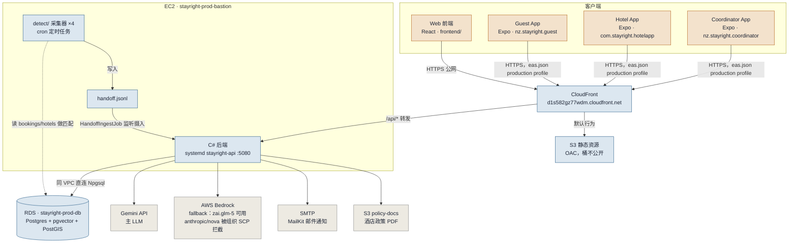
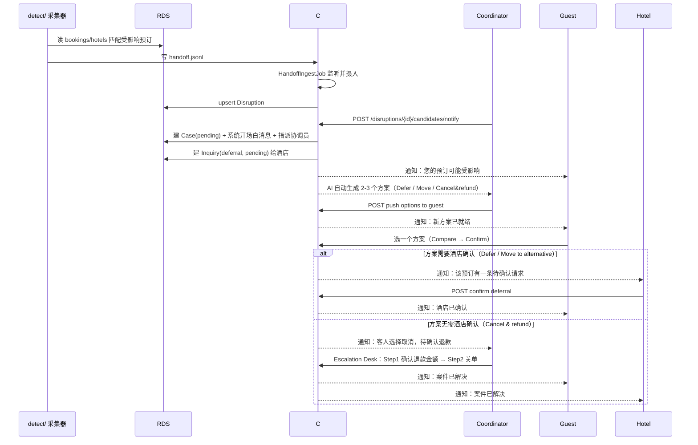

# 系统结构图 & 关键时序图

**最后核实**：2026-09-24（三个手机 App 连 CloudFront 已在 Android 模拟器上实测走通，不是只改了配置没验证）

这份文档描述的是**部署在 AWS 上的生产环境**，不含本地开发流程——本地怎么连库、怎么起服务见 `docs/DATABASE_ACCESS.md` / `docs/TEAM_DB_ACCESS.md` / `docs/DEV_DB_SETUP.md`，这里不重复。

这份文档回答两个问题：

1. **结构图**——Web 前端、三个手机 App、后端、数据库、外部服务在生产环境里实际连的是谁、走的是哪条路。
2. **时序图**——一条扰动从被采集到案件解决，具体按什么顺序经过哪些接口（对应 `CLAUDE.md`"必须遵循的模式"里"采集 → 变化检测 → 匹配 → 闸门 → 裁决 → 触达 → 回调 → 重订"那条描述，这里画成了实际验证过的接口调用顺序）。

两张图都用 Mermaid 写，GitHub 打开本文件会直接渲染，不需要额外工具；改代码/改部署方式之后，**图跟着改，不要让它变成第二份漂移的文档**。

---

## 1. 系统结构图

**图例**：蓝色系 = EC2/RDS 组成的生产核心链路；橙色系 = 四个客户端（Web + 三个手机 App），全部经 CloudFront 打进来；灰色 = 后端对外调用的外部服务。实线箭头都是已验证可用的连接；虚线（`detect → RDS` 那条）是只读查询，跟其他写入路径区分开。

### 几个容易搞混的点

- **四个客户端走的是同一个入口**：Web 前端和三个手机 App（生产构建，`eas.json` 的 `production` profile）都连 `https://d1s582gz77wdm.cloudfront.net`，CloudFront 按路径分流——静态资源走 S3，`/api/*` 转发到 EC2 后端。三个手机 App 这条路径已在 2026-09-24 于 Android 模拟器实测：登录、Cookie/Session 跨域认证、真实 prod 数据读取全部验证通过。
- **EC2 后端连库直连，不经任何中间层**：后端和 RDS 在同一个 VPC，走 Npgsql 直连 5432 端口。
- **detect 采集器没有对外接口**：是 EC2 上的 cron 任务，不能被手机/前端直接调用，只能通过它写入 `handoff.jsonl` → 后端摄入 → 案件/通知这条链路间接产生影响。
- **EC2 安全组只放行 CloudFront**：后端 5080 端口的入站规则只认 CloudFront 官方 IP 段（托管前缀列表），不对公网裸开——所有客户端流量必须经过 CloudFront 这一层，没有绕开的路径。

---

## 2. 关键时序图：一条扰动从检测到案件解决

覆盖种子数据里全是 closed case、平时测不到的这条主链路（本序列已在 2026-09-23 用 `scripts/seed-open-case.sh` 实测走通过一遍，不是凭接口猜的）。

**备注**：`alt` 分支对应的是两类方案的不同收尾路径——需要酒店确认的（Defer/Move）走酒店端 `/hotel/inquiries/{id}/confirm`；不需要酒店确认的（Cancel & refund）直接进协调员的 Escalation Desk 走最终决议。两条分支都已用真实 open case 走通过，不是理论推测。

---

## 维护约定

- 这两张图描述的是**生产环境的当前实现状态**，不是设计目标——架构变了（比如换了认证方式、加了新的外部服务），**先改代码再改图**，图跟着代码走，不要反过来。
- 改动较大时更新顶部"最后核实"日期。
- 本文档只画生产环境的"连接关系"和"调用顺序"，不含本地开发流程——本地怎么连库、密钥怎么给见 `docs/DATABASE_ACCESS.md` / `docs/TEAM_DB_ACCESS.md` / `docs/DEV_DB_SETUP.md`；AWS 资源清单/写法见 `docs/AWS_SDK_SPEC.md`。不在这里重复那几份文档的内容。
